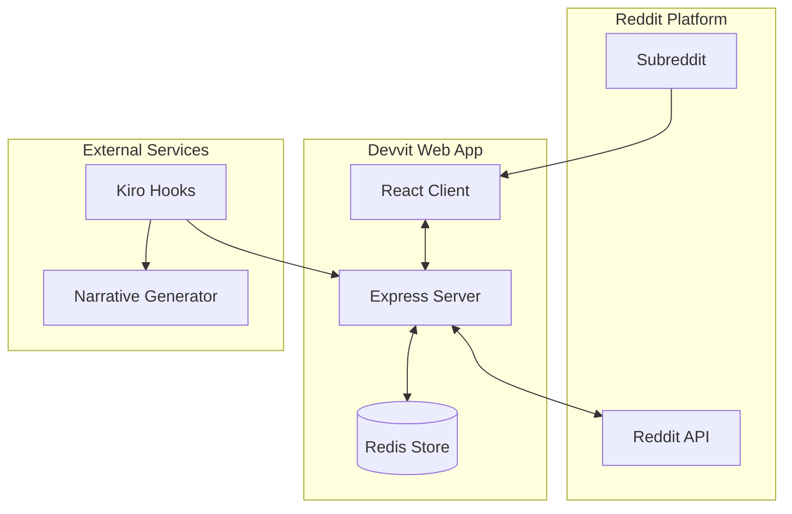

# Design Document

## Overview

Cinnarito is a community-driven Reddit game built on the Devvit Web platform that transforms subreddits into collaborative virtual gardens. The game leverages React for the frontend, Express.js for the backend API, and Redis for real-time state management. Each subreddit maintains its own "Spirit Tree" that grows through collective player actions, creating a delightful social experience that encourages community engagement.

The architecture follows a client-server model where the React frontend communicates with an Express.js backend through RESTful APIs. Game state is persisted in Redis with subreddit-specific namespacing, and real-time updates are achieved through polling mechanisms. The game integrates deeply with Reddit's ecosystem by tying resource generation to actual Reddit engagement (upvotes, comments) and automatically generating community chronicles through Kiro hooks.

## Architecture

### High-Level Architecture



### Component Architecture

```mermaid
graph TB
    subgraph "Client Components"
        App[App.tsx]
        Splash[SplashScreen]
        Garden[CommunityGarden]
        Actions[ActionPanel]
        Tree[SpiritTree]
        Spirits[FloatingSpirits]
        Robot[RedditRobot]
    end
    
    subgraph "Hooks & State"
        GS[useGameState]
        AS[useActions]
        WS[useWebSocket]
    end
    
    subgraph "Server Routes"
        Init[/api/init]
        Plant[/api/plant]
        Feed[/api/feed]
        Charge[/api/charge]
        Post[/api/post]
        State[/api/state]
    end
    
    App --> Splash
    App --> Garden
    Garden --> Actions
    Garden --> Tree
    Garden --> Spirits
    Garden --> Robot
    
    Garden --> GS
    Actions --> AS
    Garden --> WS
    
    GS --> Init
    AS --> Plant
    AS --> Feed
    AS --> Charge
    AS --> Post
    WS --> State
```

## Components and Interfaces

### Client Components

#### SplashScreen Component
```typescript
interface SplashScreenProps {
  onStart: () => void;
}

interface SplashScreenState {
  isAnimating: boolean;
  showStartButton: boolean;
}
```

**Responsibilities:**
- Display Cinnarito logo with fade-in animation
- Show animated Spirit and Reddit Robot characters
- Handle "Press Start" button interaction
- Smooth transition to main game view

#### CommunityGarden Component
```typescript
interface CommunityGardenProps {
  subredditName: string;
  gameState: GameState;
  onAction: (action: PlayerAction) => void;
}

interface GameState {
  treeLevel: number;
  seedsPlanted: number;
  spiritsFed: number;
  robotCharged: number;
  totalGrowth: number;
  lastUpdated: Date;
  playerResources: PlayerResources;
}
```

**Responsibilities:**
- Render the main garden canvas/tilemap
- Display Spirit Tree with appropriate growth level
- Show floating spirits with smooth animations
- Render Reddit Robot with collection animations
- Handle player click interactions
- Update visual state based on game data

#### ActionPanel Component
```typescript
interface ActionPanelProps {
  playerResources: PlayerResources;
  onPlant: () => void;
  onFeedSpirit: () => void;
  onChargeRobot: () => void;
  onPostUpdate: () => void;
  disabled: boolean;
}

interface PlayerResources {
  cinnamon: number;
  seeds: number;
  energy: number;
}
```

**Responsibilities:**
- Display action buttons with emoji icons
- Show resource costs and availability
- Handle action button clicks
- Provide visual feedback for successful/failed actions
- Disable actions when resources insufficient

### Server API Endpoints

#### Game State Management
```typescript
// GET /api/init/:subreddit
interface InitResponse {
  type: 'init';
  subredditName: string;
  gameState: GameState;
  playerResources: PlayerResources;
  username: string;
}

// POST /api/action
interface ActionRequest {
  type: 'plant' | 'feed' | 'charge' | 'post';
  subredditName: string;
  username: string;
}

interface ActionResponse {
  success: boolean;
  newGameState: GameState;
  newPlayerResources: PlayerResources;
  message?: string;
}
```

#### Real-time State Synchronization
```typescript
// GET /api/state/:subreddit
interface StateResponse {
  gameState: GameState;
  lastModified: Date;
  activePlayerCount: number;
}
```

### Custom Hooks

#### useGameState Hook
```typescript
interface UseGameStateReturn {
  gameState: GameState | null;
  playerResources: PlayerResources | null;
  loading: boolean;
  error: string | null;
  refreshState: () => Promise<void>;
}
```

**Responsibilities:**
- Manage game state fetching and caching
- Handle real-time state synchronization
- Provide loading and error states
- Implement optimistic updates

#### useActions Hook
```typescript
interface UseActionsReturn {
  plantSeed: () => Promise<boolean>;
  feedSpirit: () => Promise<boolean>;
  chargeRobot: () => Promise<boolean>;
  postUpdate: () => Promise<boolean>;
  isActionInProgress: boolean;
}
```

**Responsibilities:**
- Handle all player actions
- Implement optimistic UI updates
- Manage action cooldowns and validation
- Provide feedback for action results

## Data Models

### Game State Schema
```typescript
interface GameState {
  subredditName: string;
  treeLevel: number;
  totalGrowth: number;
  seedsPlanted: number;
  spiritsFed: number;
  robotCharged: number;
  dailyUpvotes: number;
  lastGrowthCalculation: Date;
  createdAt: Date;
  updatedAt: Date;
}
```

### Player Resources Schema
```typescript
interface PlayerResources {
  username: string;
  subredditName: string;
  cinnamon: number;
  seeds: number;
  energy: number;
  totalContributions: number;
  lastActive: Date;
}
```

### Action History Schema
```typescript
interface ActionHistory {
  id: string;
  username: string;
  subredditName: string;
  actionType: 'plant' | 'feed' | 'charge' | 'post';
  resourcesSpent: number;
  timestamp: Date;
  growthContributed: number;
}
```

### Redis Data Structure
```typescript
// Subreddit game state
Key: `cinnarito:subreddit:${subredditName}:state`
Value: GameState (JSON)

// Player resources
Key: `cinnarito:player:${username}:${subredditName}:resources`
Value: PlayerResources (JSON)

// Action history (sorted set for time-based queries)
Key: `cinnarito:subreddit:${subredditName}:actions`
Value: Sorted set of ActionHistory (JSON)

// Daily growth tracking
Key: `cinnarito:subreddit:${subredditName}:daily:${date}`
Value: DailyGrowthStats (JSON)
```

## Error Handling

### Client-Side Error Handling

#### Network Error Recovery
```typescript
interface ErrorBoundaryState {
  hasError: boolean;
  errorMessage: string;
  retryCount: number;
}
```

**Strategy:**
- Implement exponential backoff for failed API calls
- Show user-friendly error messages with retry options
- Gracefully degrade functionality when offline
- Cache last known state for offline viewing

#### Validation Error Handling
- Validate user actions before sending to server
- Show immediate feedback for invalid actions
- Prevent double-submission of actions
- Handle resource insufficiency gracefully

### Server-Side Error Handling

#### Redis Connection Failures
```typescript
interface RedisErrorHandler {
  maxRetries: number;
  retryDelay: number;
  fallbackToMemory: boolean;
}
```

**Strategy:**
- Implement connection pooling with automatic reconnection
- Use circuit breaker pattern for Redis operations
- Fallback to in-memory storage for critical operations
- Log all Redis errors for monitoring

#### Reddit API Integration Errors
- Handle rate limiting with exponential backoff
- Gracefully handle authentication failures
- Validate subreddit permissions before operations
- Cache Reddit data to reduce API calls

## Testing Strategy

### Unit Testing

#### Component Testing
```typescript
// Example test structure
describe('CommunityGarden', () => {
  it('should render tree at correct level', () => {});
  it('should handle plant action correctly', () => {});
  it('should display floating spirits', () => {});
  it('should animate robot collection', () => {});
});
```

**Coverage Areas:**
- Component rendering with various game states
- Action button functionality and validation
- Animation trigger conditions
- Resource calculation accuracy

#### Hook Testing
```typescript
describe('useGameState', () => {
  it('should fetch initial state correctly', () => {});
  it('should handle real-time updates', () => {});
  it('should manage loading states', () => {});
  it('should handle network errors', () => {});
});
```

### Integration Testing

#### API Endpoint Testing
```typescript
describe('Game API', () => {
  it('should initialize game state for new subreddit', () => {});
  it('should handle concurrent player actions', () => {});
  it('should calculate growth correctly', () => {});
  it('should sync state across multiple clients', () => {});
});
```

#### Redis Integration Testing
- Test data persistence and retrieval
- Verify subreddit isolation
- Test concurrent access patterns
- Validate data consistency

### End-to-End Testing

#### User Journey Testing
1. **New Player Flow:**
   - Load splash screen
   - Transition to garden
   - Perform first action
   - See visual feedback

2. **Community Interaction:**
   - Multiple players in same subreddit
   - Real-time state synchronization
   - Growth calculation accuracy
   - Chronicle generation

3. **Multi-Subreddit Testing:**
   - Switch between subreddits
   - Verify state isolation
   - Test cross-subreddit functionality

### Performance Testing

#### Load Testing Scenarios
- 100 concurrent players in single subreddit
- Multiple subreddits with active players
- High-frequency action submission
- Redis performance under load

#### Animation Performance
- 60fps animation targets
- Memory usage optimization
- Battery usage on mobile devices
- Smooth transitions under load

### Visual Regression Testing
- Screenshot comparison for UI components
- Animation consistency across browsers
- Color palette adherence
- Responsive design validation

## Implementation Considerations

### Real-time Synchronization
- Use polling with smart intervals (faster when active)
- Implement WebSocket fallback for better real-time experience
- Handle connection drops gracefully
- Optimize payload size for mobile users

### Mobile Optimization
- Touch-friendly action buttons
- Responsive garden layout
- Optimized animations for mobile performance
- Offline capability for viewing

### Accessibility
- Screen reader support for game state
- Keyboard navigation for all actions
- High contrast mode support
- Alternative text for visual elements

### Security Considerations
- Validate all user inputs server-side
- Rate limit actions to prevent abuse
- Sanitize user-generated content
- Secure Redis access with authentication

### Scalability Planning
- Horizontal scaling for multiple subreddits
- Database sharding strategies
- CDN integration for static assets
- Caching strategies for frequently accessed data